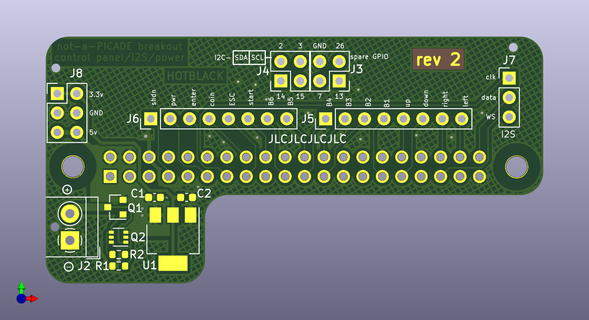
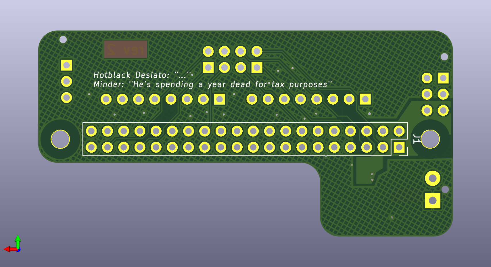

# 2 Layer PCB version  

This is a fork of the base project that uses the base project schematic with a re-spin 2-layer PCB  

The main project folder still needs to be grabbed even if you only want to work on the 2-Layer as the base project schematic is used as a schematic sheet in this project.  
