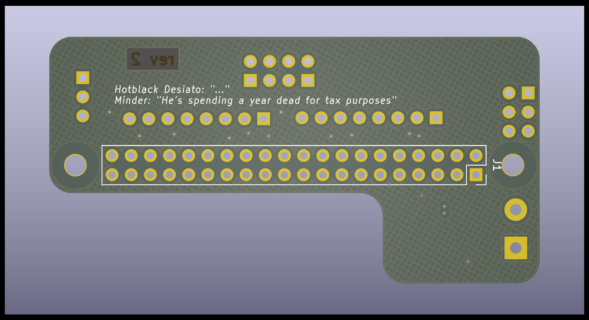

# retropie minicade hat

  
  

## Overview

Just a tarted up Raspberry pi GPIO breakout and grouping board aimed at making retropie control panels easier.. no party tricks except for 5v power input.

### PCB layers NOTE:

There are both 4-layer and 2-layer versions of this PCB so in most PCB fabs, you will get merrily rogered for the privilege of those extra 2 layers. There is one fab that doesn't, this is not an advert so I'm not going to say which (unless you ask me) but if you've spent any time having PCB's made, you probably know which one it is. If you want the 2 layer version then go ahead and get the gerbers from the /2-layer folder. If you want to load the 2 layer project into kicad, you still need to get the whole project as it uses the base project schematic as an internal hierarchical schematic sheet.  

### NOTE end

The Retropie minicade (not a) hat is for breaking out groups of pins for Retropie control panels and is pin compatible with the Pimoroni PiCade hat and some of the pin locations are oddly chosen for routing simplicity, nothing else, and there are a few missing features from the Pimoroni board:
  
* No on board I2S DAC.
* No smart switch integrated. Sorry.
* No 'HAT' EEPROM. you'll have to configure the overlays youself. This is why it's not-a-hat.
* No dedicated plasma port (not that hard to wire APA-102's yourself)
* No pimoroni branding (you won't see it once it's all tucked away in your case anyway)  

All this means :

* Smaller. This (not a) hat doesn't cover the CPU area so you can run heat sinks and fans
* Simpler. you're in charge of your own destiny.
* The I2S lines are broken out to use a DAC of your choosing such as a UDA1334 or even an external MAX decoder.
* Chonky 5v in screw terminal for any kind of power supply
* There's still Pi foundation compliant backpower protection
* On-board 3.3v regulator for powering spicy 3.3v peripherals
* H2G2 themed codename (following in the footsteps of my ZZ9 Plural Z Alpha board, this one is Hotblack Desiato - lead singer of the band *DISASTER AREA*)
* Design is in KiCAD 6.0, not nightly so you can open it in the current stable release
* Probably some other things I can't think of right now

## BOM

J1 - 2x20 pin header socket  
J2 - 5mm 2p screw terminal  
J3,4,5,6,7,8 - 2.54mm pitch header pins or sockets, or leave bare for soldering directly. Your choice, I'm not your mum, do what you want.  
C1,C2 - 22uF 0603 6.3v (or better) MLCC capacitor - low ESR  
Q1 - DMG2305UX SOT-23 p-channel FET  
Q2 - MMDT5401 dual PNP transistor SC-70-6  
R1 - 10K 0603  
R2 - 47K 0603  
U1 - AMS1117-3.3 SOT-223-3 (or any other SOT-223-3 fixed 3.3v regulator. whatever you can get from your supplier of choice)

Here are some part numbers from lcsc.com if you are that way inclined. They are from within the JLC PCB assembly stock subset and are 'basic' parts wherever possible if you feel the need to have the factory assemble the boards for you.

C1,C2 = C86295  
J1 = C169819  
Q1 = C150470  
Q2 = C54540  
R1 = C25804  
R2 = C25819  
U1 = C173386 (or a myriad of other LM1117-3.3 clones)  

## Gerbers

Are in the /prod folder for the 4-layer version and /2-Layer/prod folder for the 2-layer version. You probably don't need the 4-layer one, an entire layer for ground is probably overkill for this board, and 2nd signal layer is barely used but it's there if you want it. Have at it. I haven't generated assembly files as it's not hard to hand solder. It's easy enough to generate them yourself if you need to.  
