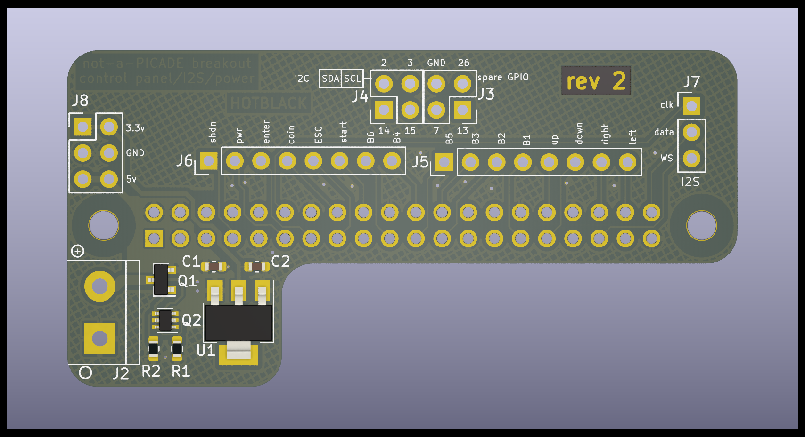

# retropie minicade hat

  
  

## Overview

### NOTE:

This is a 4-layer PCB so in most PCB fabs, you will get merrily rogered for the privilege of those extra 2 layers. there is one fab that doesn't, this is not an advert so I'm not going to say which (unless you ask me) but if you've spent any time having PCB's made, you probably know which one it is.

The Retropie minicade (not a) hat is for breaking out groups of pins for Retropie control panels and is pin compatible with the Pimoroni PiCade hat and some of the pin locations are oddly chosen for routing simplicity, nothing else, and there are a few missing a few features from the Pimoroni board:

* No on board I2S DAC.
* No smart switch integrated. Sorry.
* No 'HAT' EEPROM. you'll have to configure the overlays youself.
* No dedicated plasma port (not that hard to wire APA-102's yourself)
* No pimoroni branding (you won't see it once it's all tucked away in your case anyway)  

All this means :

* Smaller. This (not a) hat doesn't cover the CPU area so you can run heat sinks and fans
* Simpler. you're in charge of your own destiny.
* The I2S lines are broken out to use a DAC of your choosing such as a UDA1334 or even an external MAX decoder.
* Chonky 5v in screw terminal for any kind of power supply
* There's still Pi foundation compliant backpower protection
* On-board 3.3v regulator for powering spicy 3.3v peripherals
* H2G2 themed codename (following in the footsteps of my ZZ9 Plural Z Alpha board, this one is Hotblack Desiato - lead singer of the band *DISASTER AREA*)
* Probably some other things I can't think of right now

## BOM

J1 - 2x20 pin header socket  
J2 - 5mm 2p screw terminal  
J3,4,5,6,7,8 - 2.54mm pitch header pins or sockets, or leave bare for soldering directly. Your choice, I'm not your mum, do what you want.  
C1,C2 - 22uF 0603 6.3v (or better) MLCC capacitor - low ESR  
Q1 - DMG2305UX SOT-23 p-channel FET  
Q2 - MMDT5401 dual PNP transistor SC-70-6  
R1 - 10K 0603  
R2 - 47K 0603  
U1 - AMS1117-3.3 SOT-223-3 (or any other SOT-223-3 fixed 3.3v regulator. whatever you can get from your supplier of choice)

I might provide LCSC part numbers if I can be arsed...

## Gerbers

Are in the /prod folder. Have at it.